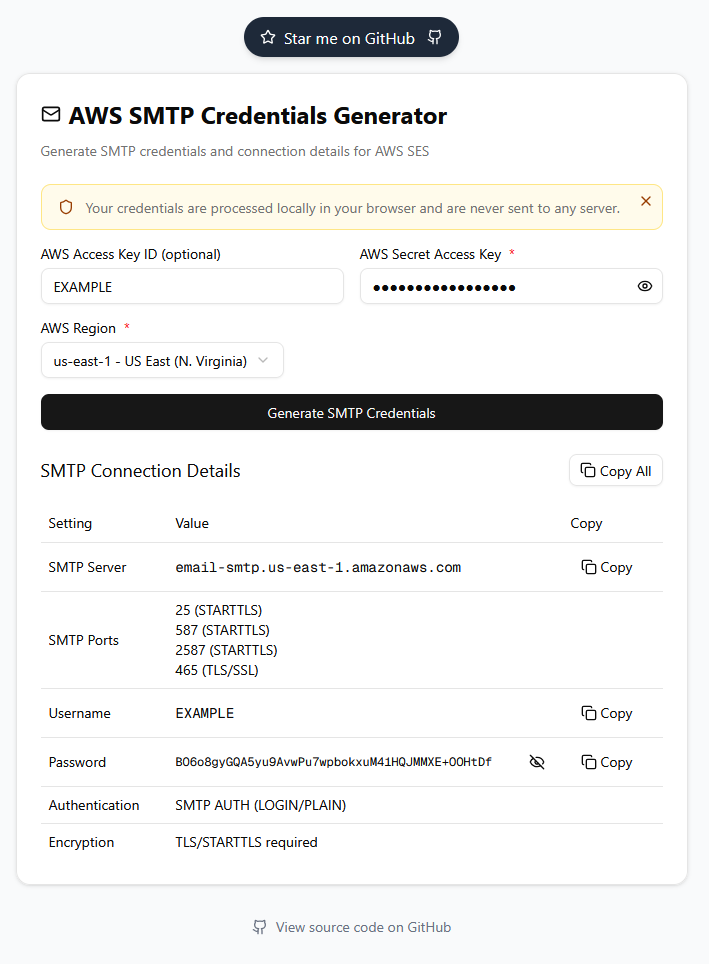

# AWS SMTP Credentials Generator

[](https://opensource.org/licenses/MIT)

A modern web application that helps you generate SMTP credentials and connection details for Amazon Simple Email Service (AWS SES). This tool simplifies the process of creating and managing SMTP credentials for your AWS SES email sending needs.



## Features

- 🔐 Generate secure SMTP credentials from AWS IAM credentials
- 📧 Get ready-to-use SMTP connection details
- 🎨 Modern and intuitive user interface
- 🌐 Works entirely in your browser - no data sent to external servers
- 🔒 Secure credential handling

## Getting Started

### Prerequisites

- Node.js (v18 or higher)
- Bun (latest version)

### Installation

1. Clone the repository:
   ```bash
   git clone https://github.com/yourusername/aws-smtp-credentials-generator.git
   cd aws-smtp-credentials-generator
   ```

2. Install dependencies:
   ```bash
   bun install
   ```

3. Start the development server:
   ```bash
   bun run dev
   ```

4. Open [http://localhost:3000](http://localhost:3000) in your browser to see the application.

## Building for Production

To create a production build:

```bash
bun run build
```

To start the production server:

```bash
bun run start
```

## Development

The project uses several modern development tools:

- **Next.js** - React framework for production
- **TypeScript** - For type safety
- **TailwindCSS** - For styling
- **Biome** - For linting and formatting
- **shadcn/ui** - For beautiful and accessible components
- **Knip** - For unused exports and dependencies detection

### Available Scripts

- `bun run dev` - Start development server with Turbopack
- `bun run build` - Create production build
- `bun run start` - Start production server
- `bun run lint` - Run Biome linter
- `bun run fmt` - Format code with Biome
- `bun run fix` - Auto-fix code issues
- `bun run knip` - Run dependency analysis

## License

This project is licensed under the MIT License - see the [LICENSE](LICENSE) file for details.
